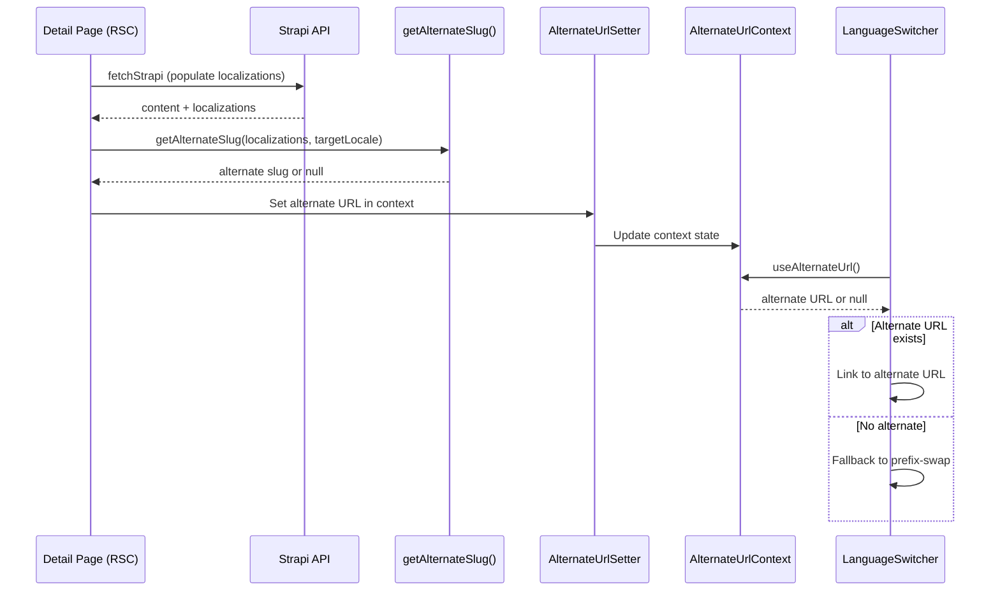
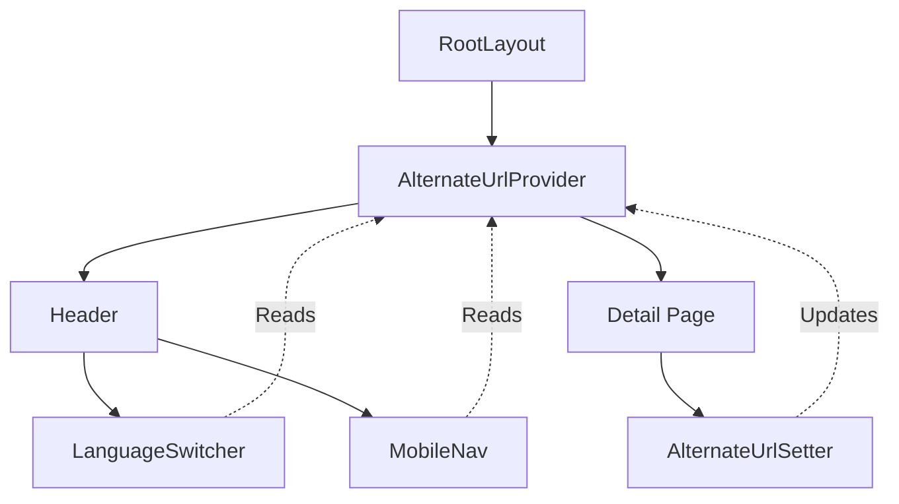

# Cross-Locale Language Switching & hreflang SEO

This document explains the implementation of intelligent language switching and multilingual SEO for the Sony Frontend Next.js application.

## Overview

The application supports English and French (`en` | `fr`) with content managed in Strapi v5. Users can switch languages on any page, and the system intelligently navigates to the correct translated content when available.

**Key Features:**
- Cross-locale slug resolution (e.g., `/fr/services/programme-prenatal` → `/en/services/pre-natal-series`)
- hreflang SEO tags for all pages
- Zero additional API calls (leverages Strapi's `localizations` relation)
- Graceful fallback to prefix-swap when translations don't exist

## Architecture

### Strapi Localizations Relation

Strapi v5 automatically provides a `localizations` field on translatable content types. This field contains an array of related content in other locales:

```typescript
// Example localizations data from Strapi
{
  "Slug": "pre-natal-series",
  "locale": "en",
  "localizations": [
    {
      "Slug": "programme-prenatal",
      "locale": "fr"
    }
  ]
}
```

**Important:** Both `en` and `fr` are the actual locale codes used in Strapi (not `fr-FR`).

### Data Flow



### Component Architecture



## Implementation Guide

### Step 1: Type Definitions

The `StrapiLocalization` interface and `localizations` field are defined in `src/types/strapi.ts`:

```typescript
export interface StrapiLocalization {
  Slug: string;
  locale: string; // "en" or "fr"
}

// Added to both Activity and Service interfaces:
localizations?: StrapiLocalization[];
```

### Step 2: Helper Functions

Helper utilities in `src/lib/i18n-helpers.ts`:

```typescript
import type { StrapiLocalization, Locale } from "@/types/strapi";

const SITE_URL = process.env.NEXT_PUBLIC_SITE_URL ?? "";

// Given current lang, finds the slug for the OTHER locale
export function getAlternateSlug(
  localizations: StrapiLocalization[] | undefined,
  currentLang: Locale,
): string | null {
  if (!localizations?.length) return null;
  const targetLocale = currentLang === "en" ? "fr" : "en";
  const alt = localizations.find((l) => l.locale === targetLocale);
  return alt?.Slug ?? null;
}

// Builds hreflang alternates for static/listing pages (simple prefix swap)
export function buildStaticAlternates(lang: Locale, path: string) {
  const enUrl = `${SITE_URL}/en${path}`;
  const frUrl = `${SITE_URL}/fr${path}`;
  return {
    canonical: lang === "en" ? enUrl : frUrl,
    languages: {
      en: enUrl,
      fr: frUrl,
      "x-default": enUrl,
    },
  };
}
```

### Step 3: Update Strapi Queries

In `src/lib/strapi.ts`, add `"localizations"` to the populate array in detail queries:

```typescript
export async function getServiceBySlug(slug: string, locale: Locale) {
  const res = await fetchStrapi<Service[]>("/services", {
    locale,
    populate: ["Image", "activities", "activities.Image", "bundles", "seo", "localizations"],
    filters: { Slug: { $eq: slug } },
  });
  return res.data[0] ?? null;
}
```

Same for `getActivityBySlug`. Listing queries (`getActivities`, `getServices`) don't need this — cards link using the current locale's slug.

### Step 4: React Context for Alternate URLs

All context code lives in a single file `src/components/AlternateUrlContext.tsx`:

```typescript
"use client";

import { createContext, useContext, useState, useEffect } from "react";

interface AlternateUrlContextValue {
  alternateUrl: string | null;
  setAlternateUrl: (url: string | null) => void;
}

const AlternateUrlContext = createContext<AlternateUrlContextValue>({
  alternateUrl: null,
  setAlternateUrl: () => {},
});

// Wrap layout children with this provider
export function AlternateUrlProvider({ children }: { children: React.ReactNode }) {
  const [alternateUrl, setAlternateUrl] = useState<string | null>(null);
  return (
    <AlternateUrlContext.Provider value={{ alternateUrl, setAlternateUrl }}>
      {children}
    </AlternateUrlContext.Provider>
  );
}

// Consumed by LanguageSwitcher and MobileNav
export function useAlternateUrl() {
  return useContext(AlternateUrlContext);
}

// Rendered by detail pages to push their alternate URL into context
export function AlternateUrlSetter({ url }: { url: string | null }) {
  const { setAlternateUrl } = useAlternateUrl();
  useEffect(() => {
    setAlternateUrl(url);
    return () => setAlternateUrl(null); // Reset on unmount
  }, [url, setAlternateUrl]);
  return null; // No UI
}
```

### Step 5: Wrap Layout with Provider

In `src/app/[lang]/layout.tsx`, wrap children with `<AlternateUrlProvider>` inside `<body>`:

```typescript
import { AlternateUrlProvider } from "@/components/AlternateUrlContext";

// Inside the body:
<AlternateUrlProvider>
  <a href="#main-content" className="skip-to-content">Skip to content</a>
  <Header lang={locale} dict={dict} />
  <main id="main-content" className="min-h-screen">{children}</main>
  <Footer lang={locale} dict={dict} />
</AlternateUrlProvider>
```

### Step 6: Update LanguageSwitcher

In `src/components/LanguageSwitcher.tsx`, read from context and use it when available:

```typescript
import { useAlternateUrl } from "@/components/AlternateUrlContext";

export function LanguageSwitcher({ lang, label }: LanguageSwitcherProps) {
  const pathname = usePathname();
  const { alternateUrl } = useAlternateUrl();
  const targetLocale = lang === "en" ? "fr" : "en";
  // Context URL takes priority; falls back to prefix-swap
  const newPath = alternateUrl ?? pathname.replace(`/${lang}`, `/${targetLocale}`);
  // ...render Link with newPath
}
```

Same pattern in `src/components/MobileNav.tsx` — import `useAlternateUrl` and use it for the language link.

### Step 7: Detail Page Implementation

Example from `src/app/[lang]/services/[slug]/page.tsx`:

```typescript
import { getAlternateSlug } from "@/lib/i18n-helpers";
import { AlternateUrlSetter } from "@/components/AlternateUrlContext";

// In generateMetadata — add alternates for hreflang tags:
const targetLang = lang === "en" ? "fr" : "en";
const altSlug = getAlternateSlug(service.localizations, lang);
const currentUrl = `/${lang}/services/${slug}`;
const altUrl = altSlug ? `/${targetLang}/services/${altSlug}` : null;

return {
  title: service.seo?.metaTitle ?? service.Title,
  alternates: {
    canonical: currentUrl,
    languages: altUrl ? {
      en: lang === "en" ? currentUrl : altUrl,
      fr: lang === "fr" ? currentUrl : altUrl,
      "x-default": lang === "en" ? currentUrl : altUrl,
    } : undefined,
  },
};

// In the page component — set context for the LanguageSwitcher:
const targetLang = lang === "en" ? "fr" : "en";
const altSlug = getAlternateSlug(service.localizations, lang);
const alternateUrl = altSlug ? `/${targetLang}/services/${altSlug}` : null;

return (
  <article>
    <AlternateUrlSetter url={alternateUrl} />
    {/* Rest of the page */}
  </article>
);
```

### Step 8: Listing Page Implementation

For static/listing pages, use `buildStaticAlternates()` in `generateMetadata`:

```typescript
import { buildStaticAlternates } from "@/lib/i18n-helpers";

export async function generateMetadata({ params }) {
  const { lang } = await params;
  const dict = await getDictionary(lang);
  return {
    title: dict.services.title,
    description: dict.services.subtitle,
    alternates: buildStaticAlternates(lang, "/services"),
  };
}
```

This generates `canonical`, `en`, `fr`, and `x-default` alternates with simple prefix-swap URLs.

## File Reference

| File | Purpose |
|------|---------|
| `src/types/strapi.ts` | `StrapiLocalization` interface, `localizations?` field on `Activity` & `Service` |
| `src/lib/i18n-helpers.ts` | `getAlternateSlug()` and `buildStaticAlternates()` helpers |
| `src/lib/strapi.ts` | `getServiceBySlug()` and `getActivityBySlug()` populate `localizations` |
| `src/components/AlternateUrlContext.tsx` | `AlternateUrlProvider`, `AlternateUrlSetter`, `useAlternateUrl` (all in one file) |
| `src/components/LanguageSwitcher.tsx` | Desktop language switcher — reads context for cross-locale URLs |
| `src/components/MobileNav.tsx` | Mobile nav — same context integration |
| `src/app/[lang]/layout.tsx` | Wraps children with `<AlternateUrlProvider>` |
| `src/app/[lang]/services/[slug]/page.tsx` | Service detail — `AlternateUrlSetter` + hreflang metadata |
| `src/app/[lang]/activities/[slug]/page.tsx` | Activity detail — same pattern |
| `src/app/[lang]/page.tsx` | Home — static hreflang alternates |
| `src/app/[lang]/services/page.tsx` | Services listing — static hreflang alternates |
| `src/app/[lang]/activities/page.tsx` | Activities listing — static hreflang alternates |
| `src/app/[lang]/links/page.tsx` | Links — static hreflang alternates |

## SEO Impact

### hreflang Tags

All pages now emit proper hreflang tags in the `<head>`:

```html
<link rel="alternate" hreflang="en" href="https://example.com/en/services/pre-natal-series" />
<link rel="alternate" hreflang="fr" href="https://example.com/fr/services/programme-prenatal" />
<link rel="alternate" hreflang="x-default" href="https://example.com/en/services/pre-natal-series" />
```

### Benefits

1. **Google Search Console** will correctly index both language versions
2. **No duplicate content penalties** — hreflang signals these are translations, not duplicates
3. **Improved international SEO** — Users see correct language version in search results
4. **x-default fallback** — English version serves as default for unsupported locales

### Validation

Use [Google's hreflang Testing Tool](https://support.google.com/webmasters/answer/189077) or [hreflang Tags Testing Tool](https://www.aleydasolis.com/english/international-seo-tools/hreflang-tags-generator/) to validate implementation.

## User Experience

### Scenario 1: Detail Page with Translation

1. User visits `/fr/services/programme-prenatal`
2. Page fetches service with `localizations: [{ Slug: "pre-natal-series", locale: "en" }]`
3. `AlternateUrlSetter` pushes `/en/services/pre-natal-series` to context
4. User clicks EN in header
5. Navigates to `/en/services/pre-natal-series` (correct English slug)

### Scenario 2: Detail Page without Translation

1. User visits `/fr/activities/some-activity`
2. Page fetches activity with `localizations: []` (no English version exists)
3. `getAlternateSlug()` returns `null`
4. Context receives `null` → fallback to prefix-swap
5. User clicks EN in header
6. Navigates to `/en/activities/some-activity` (same slug, may 404 if truly untranslated)

### Scenario 3: Listing Page

1. User visits `/fr/services`
2. `buildStaticAlternates()` generates `/en/services` ↔ `/fr/services`
3. User clicks EN
4. Navigates to `/en/services` (simple prefix-swap, safe for listing pages)

## Performance Considerations

### Zero Extra API Calls

The `localizations` field is populated in the same query that fetches the main content. This adds negligible overhead:

- **Payload increase:** ~50-100 bytes per localization entry
- **Query complexity:** No additional JOIN — localizations is a native Strapi relation
- **Network roundtrips:** Still 1 request per page

### ISR Caching

All Strapi queries use `revalidate: 60`, meaning:
- Pages are statically generated at build time
- ISR updates them every 60 seconds in production
- Alternate URLs are cached along with the main content

### Client-Side State

The React context is lightweight:
- State is scoped to the current page navigation
- Resets on unmount (no memory leaks)
- Only the header components read from context (minimal re-renders)

## Testing Checklist

- [ ] Both languages render hreflang tags in `<head>`
- [ ] Detail pages link to correct alternate slugs when translations exist
- [ ] Switcher falls back to prefix-swap when translations don't exist
- [ ] Listing pages use simple prefix-swap alternates
- [ ] `x-default` always points to English version
- [ ] No console errors from missing context provider
- [ ] Alternate URLs reset when navigating away from detail pages
- [ ] Google Search Console accepts hreflang tags without errors

## Troubleshooting

### Issue: Switcher still uses old slug in EN

**Cause:** `localizations` not populated in Strapi query.

**Fix:** Ensure `getServiceBySlug` includes:
```typescript
populate: {
  localizations: {
    fields: ["Slug", "locale"],
  },
}
```

### Issue: Context returns null on detail pages

**Cause:** `AlternateUrlProvider` not wrapping the layout.

**Fix:** Verify `layout.tsx` has:
```typescript
<AlternateUrlProvider>
  <Header />
  {children}
</AlternateUrlProvider>
```

### Issue: hreflang tags missing in production

**Cause:** `NEXT_PUBLIC_STRAPI_URL` not set in environment.

**Fix:** Add to `.env.production`:
```env
NEXT_PUBLIC_STRAPI_URL=https://your-domain.com
```

### Issue: Strapi returns 400 for localizations populate

**Cause:** Using wrong populate syntax for Strapi v5.

**Fix:** Use bracket notation via `appendPopulate`:
```typescript
populate: {
  localizations: {
    fields: ["Slug", "locale"],
  },
}
```

## Future Enhancements

### Multi-Locale Support (3+ Languages)

If adding Spanish, Portuguese, etc.:

1. Update `Locale` type to union: `"en" | "fr" | "es" | "pt"`
2. Modify `getAlternateSlug()` to return map: `Record<Locale, string>`
3. Update context to store all alternate URLs, not just one
4. LanguageSwitcher becomes a dropdown instead of toggle

### Strapi Locale Code Mismatch

If Strapi uses different codes (e.g., `en-US`, `fr-CA`):

1. Create a `LOCALE_MAP` in `strapi.ts`:
```typescript
const LOCALE_MAP: Record<Locale, string> = {
  en: "en-US",
  fr: "fr-CA",
};
```

2. Map in both directions:
```typescript
// App → Strapi
const strapiLocale = LOCALE_MAP[locale];

// Strapi → App
const appLocale = Object.entries(LOCALE_MAP).find(([_, v]) => v === strapiLoc)?.[0];
```

### Automatic Locale Detection

To auto-redirect based on user's browser locale:

1. Middleware already detects `Accept-Language`
2. Add cookie to remember user's preference
3. Skip redirect if cookie is set
4. Update `src/middleware.ts` to check cookie before redirect

## References

- [Next.js Metadata API - Alternates](https://nextjs.org/docs/app/api-reference/functions/generate-metadata#alternates)
- [Google hreflang Implementation Guide](https://developers.google.com/search/docs/specialty/international/localized-versions)
- [Strapi v5 Internationalization (i18n)](https://docs.strapi.io/dev-docs/i18n)
- [Next.js App Router Internationalization](https://nextjs.org/docs/app/building-your-application/routing/internationalization)

---

**Document Version:** 1.0
**Last Updated:** 2026-02-14
**Maintainer:** Sony Frontend Team
