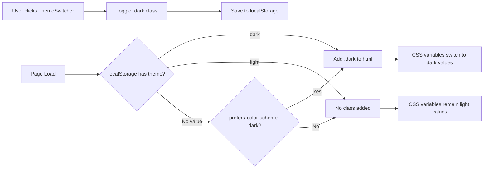
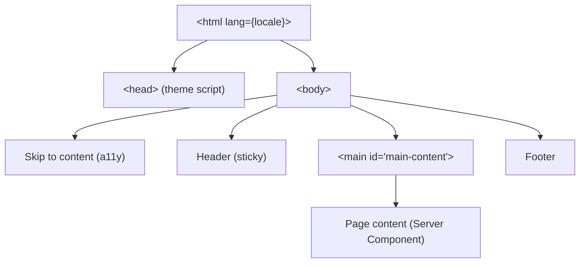
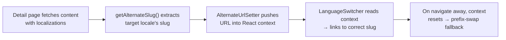
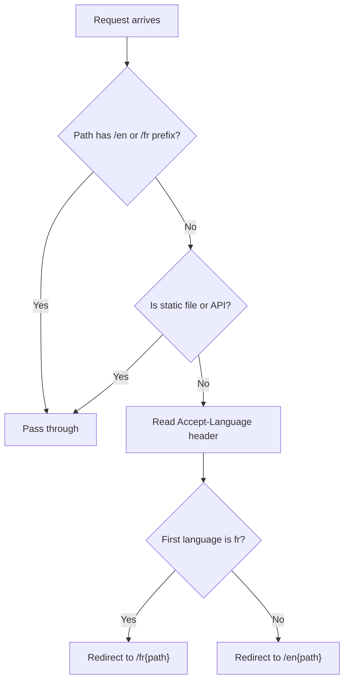
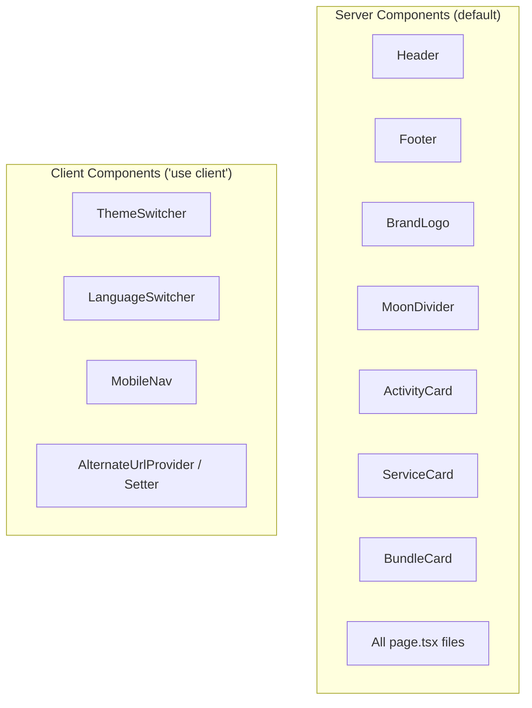

# UI/UX Architecture

Technical reference for the Sony Yoga frontend design system, component patterns, and implementation details.

---

## Table of Contents

1. [Design System](#design-system)
2. [Typography](#typography)
3. [Dark Mode Implementation](#dark-mode-implementation)
4. [Brand Logo](#brand-logo)
5. [Layout & Navigation](#layout--navigation)
6. [Mobile Navigation](#mobile-navigation)
7. [Language Switching](#language-switching)
8. [Animations & Transitions](#animations--transitions)
9. [Accessibility](#accessibility)
10. [Component Patterns](#component-patterns)
11. [Card Components](#card-components)

---

## Design System

The project uses a **Moonlit Lavender** palette -- soft purples paired with warm neutrals -- to evoke calm and wellness. All colors are defined as CSS custom properties in `src/app/globals.css` and bridged into Tailwind v4 via the `@theme inline` directive.

### Color Tokens

| Token | CSS Variable | Light Value | Dark Value | Usage |
|-------|-------------|-------------|------------|-------|
| `background` | `--background` | `#f8f6f3` (warm linen) | `#16141a` (deep charcoal) | Page background |
| `foreground` | `--foreground` | `#2d2a32` (soft black) | `#ede8f2` (lavender white) | Body text, headings |
| `muted` | `--muted` | `#7d7488` (dusty purple) | `#a098ad` (light mauve) | Secondary text, labels |
| `border` | `--border` | `#e6e0db` (warm gray) | `#2e2a35` (dark purple-gray) | Borders, dividers |
| `surface` | `--surface` | `#ffffff` (white) | `#1e1b24` (elevated dark) | Cards, elevated surfaces |
| `accent` | `--accent` | `#8b6f9e` (muted purple) | `#b89fcc` (lighter purple) | CTAs, links, active states |
| `accent-hover` | `--accent-hover` | `#6d5580` (deeper purple) | `#cdb6de` (soft lavender) | Hover state for accent |
| `accent-soft` | `--accent-soft` | `accent @ 12% opacity` | `accent @ 12% opacity` | Backgrounds, glows, badges |

### How Theming Works

Tailwind CSS v4 uses `@theme inline` to register CSS variables as first-class Tailwind colors. This lets you write `bg-background`, `text-accent`, `border-border`, etc. directly in class names.

```css
/* src/app/globals.css */
@import "tailwindcss";

@custom-variant dark (&:where(.dark, .dark *));

@theme inline {
  --color-background: var(--background);
  --color-foreground: var(--foreground);
  /* ...all tokens mapped here */
}
```

The `@custom-variant dark` registration tells Tailwind that `dark:` prefixed utilities should match when the `.dark` class is present on an ancestor element. This is class-based dark mode, not the default `prefers-color-scheme` media query approach.

The `:root` block defines light theme values. The `.dark` block overrides them. Because Tailwind utilities reference CSS variables, switching the `.dark` class on `<html>` instantly repaints the entire page with zero JavaScript beyond the class toggle.

---

## Typography

### Font Stack

| Role | Font Family | Google Font | CSS Variable | Weights |
|------|------------|-------------|-------------|---------|
| Headings | Cormorant Garamond | `Cormorant_Garamond` | `--font-heading` | 300 (light), 400, 500, 600 |
| Body | DM Sans | `DM_Sans` | `--font-body` / `--font-sans` | 400 (regular), 500 (medium), 600 (semibold) |

Both fonts are loaded via `next/font/google` in `src/app/[lang]/layout.tsx` with `display: "swap"` for optimal loading performance. The font variables are applied to `<body>` via class names:

```tsx
<body className={`${heading.variable} ${body.variable} font-sans antialiased`}>
```

### Heading Conventions

- **Hero headings** (`h1`): `font-heading text-4xl font-light tracking-tight sm:text-5xl lg:text-7xl` -- light weight Cormorant Garamond, responsive sizing from 2.25rem to 4.5rem.
- **Section headings** (`h1` on listing pages): `font-heading text-4xl font-light tracking-tight sm:text-5xl` -- same pattern, caps at 3rem on mobile.
- **Card headings** (`h3`): `font-heading text-lg font-medium` -- medium weight, 1.125rem.
- **Footer section headings** (`h3`): `text-xs font-semibold uppercase tracking-wider text-muted` -- DM Sans, all-caps, letterspaced.

### Spacing & Tracking

- Brand name in header/footer: `tracking-[0.3em] uppercase` -- wide letterspace for the "SONY YOGA" wordmark.
- Navigation links: `tracking-wide` -- slight letterspace for readability.
- Body text: default tracking, `leading-relaxed` for paragraph content.

---

## Dark Mode Implementation

### Architecture



### Flash Prevention

A blocking inline `<script>` in `<head>` reads `localStorage` before the body renders, preventing a flash of wrong theme (FOWT):

```js
// src/app/[lang]/layout.tsx -- themeScript constant
(function(){
  try {
    var theme = localStorage.getItem("theme");
    if (theme === "dark" || (!theme && window.matchMedia("(prefers-color-scheme: dark)").matches)) {
      document.documentElement.classList.add("dark");
    }
  } catch(e) {}
})();
```

The `<html>` tag includes `suppressHydrationWarning` to prevent React hydration warnings caused by the class mismatch between server render (no `.dark`) and client (possibly `.dark`).

### ThemeSwitcher Component

**File:** `src/components/ThemeSwitcher.tsx`
**Directive:** `"use client"`

The toggle button:
1. Reads the current `.dark` class state on mount via `useEffect`.
2. On click, toggles the `.dark` class on `document.documentElement`.
3. Persists the choice to `localStorage` under the key `"theme"`.
4. Renders a moon icon (light mode) or sun icon (dark mode) with a 360-degree rotation transition.
5. Includes a dynamic `aria-label` that updates based on the current state.

### Cosmic Background Effect

In dark mode, the `<body>` receives a fixed radial gradient overlay that creates a subtle "cosmic" nebula effect:

```css
.dark body {
  background-image:
    radial-gradient(circle at 20% 30%, var(--accent-soft) 0%, transparent 50%),
    radial-gradient(circle at 80% 70%, var(--accent-soft) 0%, transparent 40%);
  background-attachment: fixed;
}
```

Additionally, `h1` and `h2` elements gain a soft text-shadow glow:

```css
.dark h1,
.dark h2 {
  text-shadow: 0 0 40px var(--accent-soft);
}
```

### Theme Transition

The body applies a smooth `0.3s ease` transition on `background-color` and `color` to avoid jarring theme switches:

```css
body {
  transition: background-color 0.3s ease, color 0.3s ease;
}
```

---

## Brand Logo

**File:** `src/components/BrandLogo.tsx`
**Directive:** Server component (no `"use client"`)

### Dual-Image Swap

The component renders two `next/image` instances side by side -- one for light mode, one for dark -- and uses Tailwind's `dark:` variant to toggle visibility:

```tsx
<Image src="/logo.png"          className="opacity-75 dark:hidden" />
<Image src="/logo-inverted.png" className="hidden opacity-75 dark:block" />
```

This is a pure CSS approach: no JavaScript, no hydration cost, no flash. Both images are loaded by the browser but only one is visible at any time.

### Props

| Prop | Type | Default | Description |
|------|------|---------|-------------|
| `size` | `number` | `40` | Width and height in pixels |
| `className` | `string` | `""` | Additional CSS classes on the wrapper `<span>` |

### Opacity

Both logos render at `opacity-75` to blend with the muted color scheme rather than demanding visual attention.

### Usage Locations

| Location | Size | File |
|----------|------|------|
| Header (desktop & mobile) | 36px | `src/components/Header.tsx` |
| Mobile nav overlay | 36px | `src/components/MobileNav.tsx` |
| Footer brand section | 48px | `src/components/Footer.tsx` |
| Links page hero | 56px | `src/app/[lang]/links/page.tsx` |

---

## Layout & Navigation

### Page Structure



**File:** `src/app/[lang]/layout.tsx`

The `<main>` element has `min-h-screen` to ensure the footer is always pushed to the bottom of the viewport even on short pages.

### Header

**File:** `src/components/Header.tsx`
**Directive:** Server component

| Feature | Implementation |
|---------|---------------|
| Sticky positioning | `sticky top-0 z-50` |
| Frosted glass effect | `bg-background/80 backdrop-blur-md` (80% opacity background + blur) |
| Gradient separator | `after:` pseudo-element with `bg-gradient-to-r from-transparent via-border to-transparent` |
| Max width | `max-w-6xl` (72rem / 1152px) centered with `mx-auto` |
| Responsive nav | Desktop links hidden below `md` breakpoint; MobileNav shown only below `md` |

Desktop navigation items use `text-muted` with `hover:text-foreground` for a subtle interaction pattern.

### Footer

**File:** `src/components/Footer.tsx`
**Directive:** Server component

Layout: 3-column grid on `sm:` breakpoint and above, stacking on mobile.

| Column | Content |
|--------|---------|
| Left | Brand logo (48px) + "Sony Yoga" wordmark + tagline |
| Center | Navigation links (Activities, Services, Links) |
| Right | Social/connect section linking to Links page |

**Moon divider:** A decorative separator between the grid and the copyright, using three accent-colored circles flanked by gradient lines. Marked `aria-hidden="true"`.

The footer uses the same gradient top separator as the header bottom: `bg-gradient-to-r from-transparent via-border to-transparent`.

### MoonDivider Component

**File:** `src/components/MoonDivider.tsx`
**Directive:** Server component

A reusable decorative element depicting lunar phases -- five circles (new, waxing, full, waning, new) separated by gradient lines. Used on the home page below the hero section. The footer has its own inline simplified version.

---

## Mobile Navigation

**File:** `src/components/MobileNav.tsx`
**Directive:** `"use client"`

### Portal Pattern

The mobile nav overlay is rendered via `createPortal(overlay, document.body)` to escape the header's stacking context. Without this, the header's `backdrop-blur-md` and `z-50` would clip or interfere with the fullscreen overlay.

### Z-Index Strategy

| Layer | Z-Index | Element |
|-------|---------|---------|
| Mobile nav overlay | `z-100` | Fullscreen navigation portal |
| Header | `z-50` | Sticky header |
| Skip-to-content | `z-index: 100` (CSS) | Accessibility skip link |
| Default content | `auto` | Page content |

The overlay uses `z-100` (higher than the header's `z-50`) to guarantee it always covers the full viewport.

### Behavior

1. **Open:** Hamburger button triggers `setOpen(true)`. Body scroll is locked via `document.body.style.overflow = "hidden"`. Focus moves to the close button.
2. **Close:** Close button, nav link click, or `Escape` key triggers `setOpen(false)`. Body scroll is restored.
3. **Cleanup:** The `useEffect` cleanup function restores `overflow` on unmount to prevent scroll lock leaks.

### Overlay Layout

- Full viewport: `fixed inset-0`
- Solid background: `bg-background` (not translucent, fully covers content)
- Centered nav links: `flex flex-1 flex-col items-center justify-center`
- Large touch targets: `py-4 text-2xl` for nav links, `h-11 w-11` for buttons

The overlay mirrors the header brand (BrandLogo + "Sony Yoga") in the top-left for visual continuity.

---

## Language Switching

### Cross-Locale Slug Resolution

Detail pages (activities, services) have different slugs per locale (e.g., `/fr/services/programme-prenatal` vs `/en/services/pre-natal-series`). Simply swapping the `/fr/` prefix to `/en/` would produce a 404.

**Solution:** Strapi's `localizations` relation is populated at fetch time. A React context bridges the page-level alternate URL to the layout-level switcher.



**Key files:**
- `src/components/AlternateUrlContext.tsx` — `AlternateUrlProvider`, `AlternateUrlSetter`, `useAlternateUrl`
- `src/lib/i18n-helpers.ts` — `getAlternateSlug()`, `buildStaticAlternates()`

For full implementation details, see `docs/i18n-cross-locale-switching.md`.

### Desktop: LanguageSwitcher

**File:** `src/components/LanguageSwitcher.tsx`
**Directive:** `"use client"`

A single clickable `<Link>` showing `EN / FR` with the active locale highlighted in `text-foreground` and the inactive locale in `text-muted`. The component reads `useAlternateUrl()` from context — when set (on detail pages), it links to the correct cross-locale URL. When absent (listing/static pages), it falls back to prefix-swap:

```
/en/activities         --> /fr/activities          (prefix swap)
/fr/services/slug-fr   --> /en/services/slug-en    (from localizations)
```

The `hrefLang` attribute is set on the link for SEO and accessibility.

### Mobile: Inline Language Link

In the MobileNav, language switching uses the same `useAlternateUrl()` context for cross-locale resolution, with prefix-swap as the fallback.

### hreflang SEO Tags

All pages emit `<link rel="alternate" hreflang="en/fr/x-default">` tags via Next.js `generateMetadata` `alternates.languages`:
- **Detail pages** — URLs derived from `localizations` data
- **Listing/static pages** — Simple prefix swap via `buildStaticAlternates()`
- **x-default** — Always points to the English URL

### Middleware Locale Detection

**File:** `src/middleware.ts`



The matcher pattern `/((?!_next|api|favicon.ico|favicon.png|.*\\..*).*)` ensures static assets, API routes, and files with extensions are excluded from locale redirection.

---

## Animations & Transitions

### Breathing Glow (Hero)

**File:** `src/app/globals.css` (keyframes) + `src/app/[lang]/page.tsx` (usage)

A large blurred accent circle behind the hero text that pulsates with a breathing rhythm:

```css
@keyframes breathe {
  0%, 100% { opacity: 0.3; transform: scale(1); }
  40%      { opacity: 0.6; transform: scale(1.05); }
  60%      { opacity: 0.6; transform: scale(1.05); }
}
```

Applied via inline `style={{ animation: "breathe 8s ease-in-out infinite" }}` on a `blur-3xl` div. The 8-second cycle with a plateau at 40-60% creates a slow, meditative pulse.

### Card Entrance Animation

**File:** `src/app/globals.css`

Uses the CSS `@starting-style` rule (a modern CSS feature) for zero-JavaScript entrance animations:

```css
.card-enter {
  transition: opacity 0.5s ease, transform 0.5s ease;
}

@starting-style {
  .card-enter {
    opacity: 0;
    transform: translateY(12px);
  }
}
```

Cards fade in and slide up 12px when they first render. The `@starting-style` block defines the "from" state; the `.card-enter` transition handles the animation to the final state. Applied to `ActivityCard` and `ServiceCard`.

### Card Hover Effects

All cards share a consistent hover pattern:

```
hover:shadow-lg hover:shadow-accent/5 hover:border-accent/30 hover:-translate-y-1
```

This lifts the card 4px, adds a soft accent-tinted shadow, and highlights the border. `ActivityCard` images also scale on hover: `group-hover:scale-105` over 500ms.

### Theme Toggle Icon

The ThemeSwitcher icon rotates 360 degrees when transitioning between moon and sun via:

```tsx
style={{ transform: isDark ? "rotate(360deg)" : "rotate(0deg)" }}
```

Combined with `transition-transform duration-300`.

### Reduced Motion Safety Net

**File:** `src/app/globals.css`

All animations and transitions are suppressed for users with `prefers-reduced-motion: reduce`:

```css
@media (prefers-reduced-motion: reduce) {
  *, *::before, *::after {
    animation-duration: 0.01ms !important;
    animation-iteration-count: 1 !important;
    transition-duration: 0.01ms !important;
    scroll-behavior: auto !important;
  }
}
```

---

## Accessibility

### Skip-to-Content Link

**File:** `src/app/globals.css` (styles) + `src/app/[lang]/layout.tsx` (markup)

A visually hidden link positioned off-screen that becomes visible on focus, allowing keyboard users to bypass the header navigation:

```html
<a href="#main-content" class="skip-to-content">Skip to content</a>
<!-- ... header ... -->
<main id="main-content">
```

### Focus Styles

Global `:focus-visible` styles provide a consistent `2px solid accent` outline with `2px` offset on all interactive elements. The `:focus:not(:focus-visible)` rule removes outlines for mouse clicks while preserving them for keyboard navigation.

### ARIA Attributes

| Component | ARIA Pattern |
|-----------|-------------|
| Header `<nav>` | `aria-label="Main navigation"` |
| Footer `<nav>` (navigation) | `aria-label="Footer navigation"` |
| Footer `<nav>` (social) | `aria-label="Social links"` |
| MobileNav overlay | `role="dialog"`, `aria-modal="true"`, `aria-label="Navigation menu"` |
| Hamburger button | `aria-label="Open menu"` |
| Close button | `aria-label="Close menu"` |
| ThemeSwitcher | Dynamic `aria-label` ("Switch to light/dark mode") |
| LanguageSwitcher | `aria-label="Switch language to {label}"` |
| Intensity dots | `aria-label="Intensity 3 / 5"` |
| Price display | `aria-label="45.00 euros"` |
| Decorative elements | `aria-hidden="true"` on moon dividers, breathing glow |
| Gradient fallbacks | `role="img"` with `aria-label={title}` |

### Touch Targets

Buttons use minimum `h-11 w-11` (44x44px) sizing to meet WCAG 2.5.8 target size requirements. CTA links on the home page include `min-h-[44px]`.

### Semantic HTML

- `<header>`, `<nav>`, `<main>`, `<footer>` for page landmarks.
- `<article>` for individual cards (activities, services).
- `<section>` for page sections.
- `role="list"` on card grids with `role="listitem"` on individual cards for assistive technology.

---

## Component Patterns

### Server vs. Client Components



**Rule:** Components only become client components when they need browser APIs (`localStorage`, `document`), React hooks (`useState`, `useEffect`), or event handlers.

### Named Exports

All components use named exports (`export function ComponentName`) rather than default exports. This is enforced by project convention for consistent imports and better tree-shaking.

### Props Interfaces

Every component defines a `ComponentNameProps` interface directly above the component function:

```tsx
interface BrandLogoProps {
  size?: number;
  className?: string;
}

export function BrandLogo({ size = 40, className = "" }: BrandLogoProps) {
```

### Dictionary Passing

Server components that render translated text receive dictionary slices as props rather than calling `getDictionary` themselves. Only top-level pages call `getDictionary(lang)` and pass relevant sections down:

```tsx
// Page calls getDictionary
const dict = await getDictionary(lang);

// Passes slices to components
<Header lang={locale} dict={dict} />
<Footer lang={locale} dict={dict} />
```

### Gradient Fallbacks

When a Strapi image might be missing (the `Image` field is optional on Activities, and Services have no image at all), components render a CSS gradient placeholder instead of broken images:

```tsx
{imageUrl ? (
  <Image src={imageUrl} ... />
) : (
  <div className="aspect-[4/3] bg-gradient-to-br from-accent/15 via-accent-soft to-background" />
)}
```

ServiceCard uses per-type gradient variations to provide visual differentiation without images.

---

## Card Components

### ActivityCard

**File:** `src/components/ActivityCard.tsx`

| Feature | Details |
|---------|---------|
| Image | Optional; falls back to accent gradient. Uses `formats.medium` when available. |
| Hover | Card lifts (`-translate-y-1`), border highlights, image scales 105%. |
| Intensity | Visual dot indicator (1-5 filled circles) with accent glow on filled dots. |
| Link arrow | Slides right on group hover via `group-hover:translate-x-1`. |
| Animation | `.card-enter` class for `@starting-style` entrance. |

### ServiceCard

**File:** `src/components/ServiceCard.tsx`

| Feature | Details |
|---------|---------|
| Image | None (Services have no Image in Strapi). Uses type-specific gradient. |
| Type badge | Emoji + Service_Type label in a rounded `accent-soft` pill. |
| Metadata | Price in euros + duration in minutes. |
| Type gradients | Each `Service_Type` (Private, Group, Online, Event, Corporate) maps to a unique gradient. |

### BundleCard

**File:** `src/components/BundleCard.tsx`

| Feature | Details |
|---------|---------|
| Layout | Horizontal card (not grid), left-aligned info + right-aligned price. |
| Accent bar | `before:` pseudo-element -- 4px wide accent bar on the left edge. |
| Per-session price | Computed on render: `Price / Quantity`, shown in `accent-hover` color. |

---

## File Reference

| File | Role | Server/Client |
|------|------|---------------|
| `src/app/globals.css` | CSS variables, animations, a11y styles | N/A (CSS) |
| `src/app/layout.tsx` | Root layout, favicon metadata | Server |
| `src/app/[lang]/layout.tsx` | Lang layout, fonts, theme script, Header/Footer | Server |
| `src/app/[lang]/page.tsx` | Home page with hero section | Server |
| `src/app/[lang]/activities/page.tsx` | Activities listing page | Server |
| `src/app/[lang]/services/page.tsx` | Services listing page | Server |
| `src/app/[lang]/links/page.tsx` | Social links page (Linktree-style) | Server |
| `src/components/Header.tsx` | Sticky header with nav, logo, switchers | Server |
| `src/components/Footer.tsx` | Footer with 3-column grid and moon divider | Server |
| `src/components/MobileNav.tsx` | Fullscreen mobile nav via portal | Client |
| `src/components/BrandLogo.tsx` | Dark/light logo swap | Server |
| `src/components/ThemeSwitcher.tsx` | Dark mode toggle button | Client |
| `src/components/LanguageSwitcher.tsx` | EN/FR language toggle link (context-aware) | Client |
| `src/components/AlternateUrlContext.tsx` | Cross-locale URL context for language switching | Client |
| `src/components/MoonDivider.tsx` | Decorative lunar phase divider | Server |
| `src/components/ActivityCard.tsx` | Activity card with image/intensity | Server |
| `src/components/ServiceCard.tsx` | Service card with type gradients | Server |
| `src/components/BundleCard.tsx` | Bundle pricing card | Server |
| `src/middleware.ts` | Locale detection and redirect | Edge middleware |
